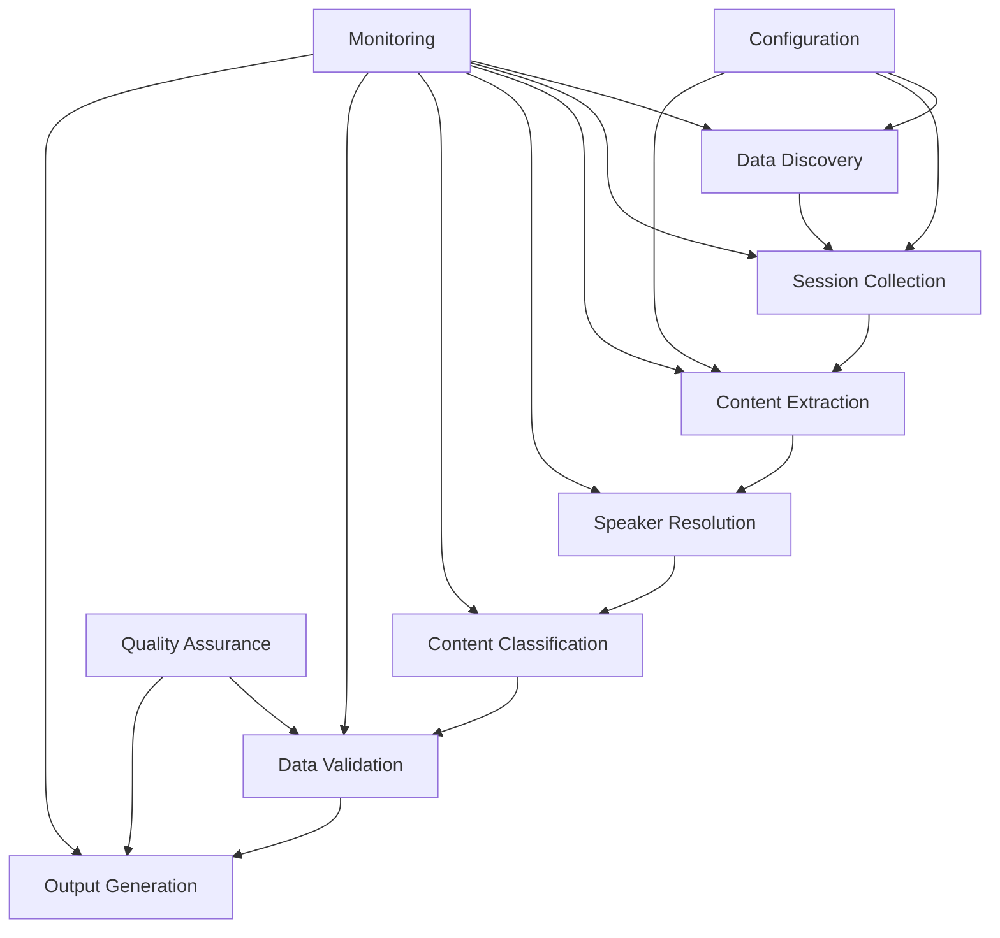

# System Architecture

## 🏗️ Overview

The EU Parliament Debates Scraper is designed as a modular, scalable data collection and processing system. The architecture follows a pipeline pattern with clear separation of concerns between data discovery, collection, processing, and output generation.

---

## 🎯 Architecture Principles

- **Modular Design**: Independent components with clear interfaces
- **Fault Tolerance**: Graceful handling of API failures and network issues  
- **Scalability**: Support for parallel processing and incremental updates
- **Data Quality**: Built-in validation and quality assurance at each stage
- **Observability**: Comprehensive logging and monitoring capabilities

---

## 📊 System Components



### 1. Data Discovery Service
**Purpose**: Identify and catalog available plenary sessions  
**Inputs**: Date ranges, session types, language preferences  
**Outputs**: Session metadata with URIs and identifiers  
**Technologies**: SPARQL queries, EU Publications Office API

### 2. Session Collection Service  
**Purpose**: Retrieve structured session data and transcripts  
**Inputs**: Session identifiers from Data Discovery  
**Outputs**: Raw session data with speaker assignments  
**Technologies**: REST APIs, HTML parsing, XML processing

### 3. Content Extraction Service
**Purpose**: Parse and structure speech segments from raw data  
**Inputs**: Raw session transcripts and metadata  
**Outputs**: Individual speech segments with timestamps  
**Technologies**: Text processing, regex patterns, NLP libraries

### 4. Speaker Resolution Service
**Purpose**: Enhance speaker data with country and party information  
**Inputs**: Speaker names and basic metadata  
**Outputs**: Enriched speaker data with affiliations  
**Technologies**: MEP database queries, fuzzy matching, caching

### 5. Content Classification Service
**Purpose**: Identify and label announcements vs. speeches  
**Inputs**: Speech segments with content and speaker metadata  
**Outputs**: Classifications and announcement type labels  
**Technologies**: Rule-based classification, pattern matching

### 6. Data Validation Service
**Purpose**: Ensure data quality and completeness  
**Inputs**: Processed speech segments  
**Outputs**: Validated data with quality metrics  
**Technologies**: Data validation frameworks, statistical analysis

### 7. Output Generation Service
**Purpose**: Format and export final datasets  
**Inputs**: Validated speech segments  
**Outputs**: CSV, JSONL, and documentation files  
**Technologies**: Pandas, JSON libraries, template engines

---

## 🔄 Data Flow Architecture

### Phase 1: Discovery & Collection
```
Configuration → Data Discovery → Session List → Session Collection → Raw Data
```

### Phase 2: Processing & Enhancement  
```
Raw Data → Content Extraction → Speaker Resolution → Content Classification → Processed Data
```

### Phase 3: Validation & Output
```
Processed Data → Data Validation → Quality Metrics → Output Generation → Final Datasets
```

---

## 📁 Directory Structure

```
eu_scrape/
├── src/                           # Source code
│   ├── discovery/                 # Data discovery services
│   │   ├── sparql_client.py      # SPARQL query execution
│   │   ├── session_finder.py     # Session discovery logic
│   │   └── metadata_collector.py # Metadata aggregation
│   ├── collection/               # Data collection services
│   │   ├── api_client.py         # REST API client
│   │   ├── html_parser.py        # HTML content parsing
│   │   └── xml_processor.py      # XML data processing
│   ├── processing/               # Data processing services
│   │   ├── content_extractor.py  # Speech segment extraction
│   │   ├── speaker_resolver.py   # Speaker data enhancement
│   │   └── classifier.py         # Content classification
│   ├── validation/               # Data validation services
│   │   ├── quality_checker.py    # Quality assurance
│   │   ├── completeness.py       # Data completeness checks
│   │   └── accuracy.py           # Accuracy validation
│   ├── output/                   # Output generation
│   │   ├── csv_exporter.py       # CSV file generation
│   │   ├── jsonl_exporter.py     # JSONL file generation
│   │   └── documentation.py      # README generation
│   ├── core/                     # Core utilities
│   │   ├── config.py             # Configuration management
│   │   ├── logging.py            # Logging setup
│   │   ├── monitoring.py         # Health checks and metrics
│   │   └── exceptions.py         # Custom exceptions
│   └── main.py                   # Main orchestration script
├── tests/                        # Test suite
│   ├── unit/                     # Unit tests
│   ├── integration/              # Integration tests
│   └── data/                     # Test data fixtures
├── config/                       # Configuration files
│   ├── production.yaml           # Production settings
│   ├── development.yaml          # Development settings
│   └── logging.yaml              # Logging configuration
├── data/                         # Data storage
│   ├── raw/                      # Raw collected data
│   ├── processed/                # Processed data
│   ├── output/                   # Final output files
│   └── cache/                    # Cached API responses
└── scripts/                      # Utility scripts
    ├── setup.py                  # Environment setup
    ├── run_pipeline.py           # Pipeline execution
    └── validate_output.py        # Output validation
```

---

## 🔌 Component Interfaces

### Configuration Interface
```python
@dataclass
class ProcessingConfig:
    date_range: Tuple[date, date]
    languages: List[str]
    output_formats: List[str]
    quality_thresholds: Dict[str, float]
    api_rate_limits: Dict[str, int]
    parallel_workers: int = 4
```

### Data Models
```python
@dataclass  
class SessionMetadata:
    session_id: str
    date: date
    title: str
    session_type: str
    language: str
    source_uri: str

@dataclass
class SpeechSegment:
    speaker_name: str
    speaker_country: str
    speaker_party_or_group: str
    segment_start_ts: datetime
    segment_end_ts: datetime  
    speech_text: str
    is_announcement: bool
    announcement_label: Optional[str]
    quality_score: float
```

### Service Interfaces
```python
class DataDiscoveryService:
    def find_sessions(self, config: ProcessingConfig) -> List[SessionMetadata]:
        """Discover available sessions within date range."""
        pass
    
class ContentExtractionService:
    def extract_segments(self, raw_data: RawSession) -> List[SpeechSegment]:
        """Extract speech segments from raw session data."""
        pass

class ValidationService:
    def validate_segments(self, segments: List[SpeechSegment]) -> ValidationReport:
        """Validate segment data quality and completeness."""
        pass
```

---

## ⚡ Performance Architecture

### Parallel Processing Strategy
- **Session-Level Parallelism**: Process multiple sessions concurrently
- **Service-Level Parallelism**: Independent services can run in parallel
- **I/O Optimization**: Async HTTP requests with connection pooling
- **Caching Strategy**: API response caching to minimize redundant requests

### Scalability Considerations
- **Memory Management**: Stream processing for large datasets
- **Disk Usage**: Efficient temporary file management
- **Network Efficiency**: Request batching and compression
- **Resource Monitoring**: CPU and memory usage tracking

---

## 🛡️ Error Handling Architecture

### Error Categories
1. **Network Errors**: API timeouts, connection failures
2. **Data Errors**: Malformed responses, missing fields
3. **Processing Errors**: Classification failures, validation errors
4. **System Errors**: Disk space, memory limitations

### Recovery Strategies
```python
class ErrorHandler:
    def handle_network_error(self, error: NetworkError, context: ProcessingContext):
        """Implement exponential backoff retry logic."""
        pass
    
    def handle_data_error(self, error: DataError, context: ProcessingContext):
        """Log error and continue with partial data."""
        pass
    
    def handle_system_error(self, error: SystemError, context: ProcessingContext):
        """Graceful shutdown and state preservation."""
        pass
```

---

## 📊 Monitoring Architecture

### Health Checks
- **API Connectivity**: Monitor EU Parliament API availability
- **Data Quality**: Track quality metrics over time
- **Processing Performance**: Monitor throughput and latency
- **System Resources**: CPU, memory, and disk usage

### Metrics Collection
```python
class MetricsCollector:
    def collect_processing_metrics(self) -> Dict[str, float]:
        return {
            'sessions_processed_per_hour': 0.0,
            'segments_extracted_per_session': 0.0,
            'speaker_resolution_rate': 0.0,
            'classification_accuracy': 0.0,
            'data_quality_score': 0.0
        }
```

---

## 🔗 Cross-References

### Related Documentation
- [API Integration](./API_INTEGRATION.md) - Detailed API specifications
- [Data Schema](../data/DATA_SCHEMA.md) - Data model definitions
- [Configuration](../operations/CONFIGURATION.md) - System configuration
- [Quality Assurance](../data/QUALITY_ASSURANCE.md) - Quality validation procedures

### External Dependencies
- **Python Libraries**: requests, pandas, lxml, pydantic
- **EU APIs**: Publications Office SPARQL, EUR-Lex REST API
- **Data Formats**: JSON, CSV, JSONL, XML, HTML

---

*Last updated: 2025-08-28 | Next review: Implementation phase*